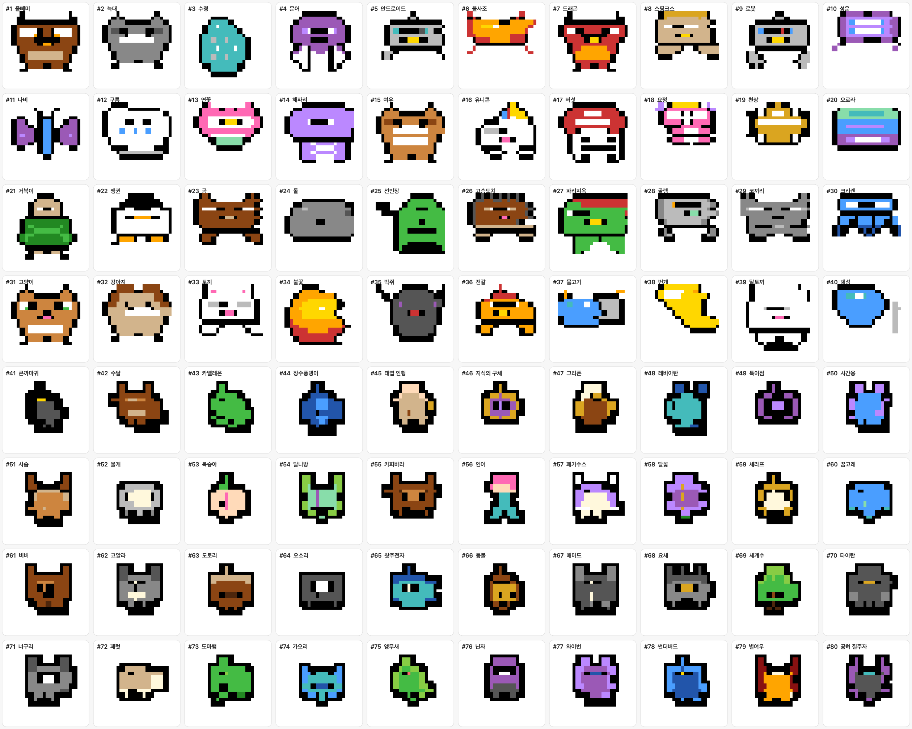
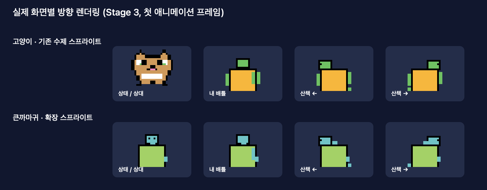
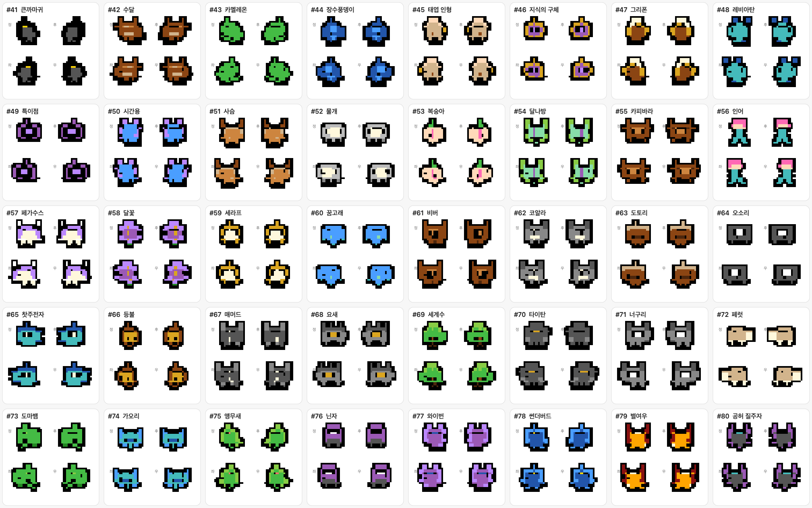

# Damagochi 캐릭터 도감

이 문서는 앱의 `Species.allSpecies`와 `SpriteSheet`가 **현재 실제로 렌더링하는** 캐릭터를 기준으로 만든 도감이다. 이름·영문명·영구 ID·MBTI 그룹·희귀도는 카탈로그와 같은 순서이며, 저장 데이터는 ID를 기준으로 복원한다.

## 실제 앱 렌더링 프리뷰

아래 이미지는 모든 캐릭터의 `alive / Stage 3 / front / 첫 애니메이션 프레임`을 `SpriteSheet.frames`로 직접 렌더링한 결과다. 카드의 `#번호`는 뒤의 캐릭터 목록 번호와 일치한다. 따라서 문서의 그림은 콘셉트 이미지가 아니라 현재 앱 화면에서 사용하는 실제 픽셀 데이터다.



## 화면별 노출 방식

| 화면 | 사용하는 방향 | 실제 노출 방식 |
|---|---|---|
| 메뉴바 팝오버의 2×2 펫 슬롯 | `front` | 선택 전에도 각 펫의 작은 정면 프리뷰와 능력치가 보인다. |
| 펫 상태 화면·장비 위치 조정 | `front` | 선택된 펫과 장비 오버레이를 정면으로 표시한다. |
| 배틀 — 내 펫 | `back` | 상대를 바라보는 뒷모습으로 표시한다. |
| 배틀 — 상대 펫 | `front` | 플레이어를 바라보는 정면으로 표시한다. |
| 공원 산책 | `sideLeft` / `sideRight` | 이동 방향에 맞춰 옆모습을 사용한다. |



- 모든 캐릭터와 성장 단계는 `front`, `back`, `sideLeft`, `sideRight` 각각 2프레임 애니메이션을 제공한다.
- Reduce Motion이 켜져 있으면 화면은 각 방향의 첫 프레임을 고정해서 사용한다.
- 장비 레이어는 항상 `기본 펫 → head/hand → effect` 순서이며, 장비 위치 오프셋도 방향별 렌더링 스케일에 맞춰 적용된다.
- Stage 1·2·3은 같은 캐릭터 ID를 유지하며 몸통 크기만 성장한다. 도감 프리뷰는 식별이 가장 쉬운 Stage 3로 통일했다.

> 참고: 1~40번은 기존 수제 정면 스프라이트를 유지하고, 41~80번은 같은 16×16 원화 규격에서 종별 실루엣을 직접 그린다. 두 경우 모두 이 문서의 프리뷰가 현재 앱 출력값이다.

프리뷰는 아래 명령으로 런타임 `SpriteSheet` 출력에서 다시 만들 수 있다.

```bash
swift run damagochi-sprite-catalog
```

확장 40종의 정면·후면·좌측·우측 프리뷰는 다음 명령으로 별도 생성한다.

```bash
swift run damagochi-sprite-catalog --directions
```



## NT — 분석형 / Theoretical

| # | 이름 | English / ID | 희귀도 | 화면에서 보이는 핵심 실루엣 |
|---:|---|---|---|---|
| 1 | 올빼미 | owl / `owl` | common | 갈색 몸, 뾰족한 귀와 검은 눈가 |
| 2 | 늑대 | wolf / `wolf` | common | 회색 얼굴, 양쪽 귀와 흰 주둥이 |
| 3 | 수정 | crystal / `crystal` | common | 청록색 다면 수정, 흰 반짝임 |
| 4 | 문어 | octopus / `octopus` | rare | 보라색 머리와 여러 다리 |
| 5 | 안드로이드 | android / `android` | rare | 회색 기계 몸, 청록·노랑 표시등 |
| 6 | 불사조 | phoenix / `phoenix` | rare | 주황·빨강 날개형 몸과 노랑 장식 |
| 7 | 드래곤 | dragon / `dragon` | legendary | 붉은 몸, 뿔과 날개형 돌기 |
| 8 | 스핑크스 | sphinx / `sphinx` | legendary | 황토색 석상형 몸과 흰 눈 |
| 9 | 로봇 | robot / `robot` | mythic | 청회색 기계 몸, 노랑 상태등 |
| 10 | 성운 | nebula / `nebula` | mythic | 보라·하늘색 가로 줄무늬 구름 |
| 41 | 큰까마귀 | Raven / `raven` | common | 검은 부리·접힌 날개와 두 다리가 보이는 새 실루엣 |
| 42 | 수달 | Otter / `otter` | common | 긴 갈색 몸, 작은 귀와 뒤로 빠지는 짙은 꼬리 |
| 43 | 카멜레온 | Chameleon / `chameleon` | common | 돌출한 눈, 초록 몸과 말린 꼬리 |
| 44 | 장수풍뎅이 | Atlas Beetle / `atlas_beetle` | rare | 푸른 등딱지의 중앙선·뿔·여섯 다리 |
| 45 | 태엽 인형 | Clockwork Doll / `clockwork` | rare | 나무 몸, 태엽 축과 관절 다리 |
| 46 | 지식의 구체 | Knowledge Orb / `orb` | rare | 보랏빛 구체를 감싼 금색 고리와 중심 광점 |
| 47 | 그리폰 | Gryphon / `gryphon` | legendary | 독수리 머리·부리, 금빛 날개와 사자형 다리 |
| 48 | 레비아탄 | Leviathan / `leviathan` | legendary | 청록 바다뱀 몸, 뿔·지느러미와 꼬리 |
| 49 | 특이점 | Singularity / `singularity` | mythic | 검은 중심을 감싼 보라색 중력 고리 |
| 50 | 시간용 | Chrono Dragon / `chrono_dragon` | mythic | 뿔·날개·꼬리를 갖춘 푸른 시간 용 |

## NF — 이상형 / Creative

| # | 이름 | English / ID | 희귀도 | 화면에서 보이는 핵심 실루엣 |
|---:|---|---|---|---|
| 11 | 나비 | butterfly / `butterfly` | common | 보라색 양날개와 파란 몸 |
| 12 | 구름 | cloud / `cloud` | common | 흰 구름형 몸, 파란 눈·입 |
| 13 | 연꽃 | lotus / `lotus` | common | 분홍 꽃잎과 민트 받침 |
| 14 | 해파리 | jellyfish / `jellyfish` | rare | 라벤더 종 모양 몸과 촉수 |
| 15 | 여우 | fox / `fox` | rare | 주황 귀·얼굴과 흰 주둥이 |
| 16 | 유니콘 | unicorn / `unicorn` | rare | 흰 몸, 노랑 뿔, 분홍 포인트 |
| 17 | 버섯 | mushroom / `mushroom` | legendary | 빨간 갓과 흰 점·줄무늬 몸 |
| 18 | 요정 | fairy / `fairy` | legendary | 분홍 몸, 노랑 왕관과 날개 |
| 19 | 천상 | celestial / `celestial` | mythic | 금색 별·십자 모양 광원 |
| 20 | 오로라 | aurora / `aurora` | mythic | 청록·보라·하늘색 띠 |
| 51 | 사슴 | Deer / `deer` | common | 갈색 뿔, 밝은 주둥이와 가는 네 다리 |
| 52 | 물개 | Seal / `seal` | common | 둥근 회색 몸, 흰 배와 양쪽 물갈퀴 |
| 53 | 복숭아 | Peach / `peach` | common | 분홍 열매의 세로 골과 초록 잎 |
| 54 | 달나방 | Luna Moth / `luna_moth` | rare | 넓게 펼친 연두 날개와 보라 무늬 |
| 55 | 카피바라 | Capybara / `capybara` | rare | 넓고 낮은 갈색 몸, 긴 주둥이와 짧은 다리 |
| 56 | 인어 | Mermaid / `mermaid` | rare | 분홍 머리와 청록색 물고기 꼬리 |
| 57 | 페가수스 | Pegasus / `pegasus` | legendary | 흰 날개·갈기와 황금 뿔 |
| 58 | 달꽃 | Moonflower / `moonflower` | legendary | 보랏빛 꽃잎, 금빛 중심과 초록 줄기 |
| 59 | 세라프 | Seraph / `seraph` | mythic | 후광과 대칭의 흰 날개 |
| 60 | 꿈고래 | Dream Whale / `dream_whale` | mythic | 파란 고래 몸, 옆지느러미·꼬리와 물기둥 |

## SJ — 전통형 / Responsible

| # | 이름 | English / ID | 희귀도 | 화면에서 보이는 핵심 실루엣 |
|---:|---|---|---|---|
| 21 | 거북이 | turtle / `turtle` | common | 초록 등딱지와 밝은 머리 |
| 22 | 펭귄 | penguin / `penguin` | common | 검정·흰 몸과 노랑 부리·발 |
| 23 | 곰 | bear / `bear` | common | 갈색 얼굴, 귀와 짧은 팔다리 |
| 24 | 돌 | rock / `rock` | rare | 회색 바위형 덩어리, 검은 점 눈 |
| 25 | 선인장 | cactus / `cactus` | rare | 밝은 초록 선인장 몸과 돌기 |
| 26 | 고슴도치 | hedgehog / `hedgehog` | rare | 갈색 가시 몸과 분홍 얼굴 |
| 27 | 파리지옥 | parrot / `parrot` | legendary | 초록 입 모양 몸, 빨간 띠·노랑 눈 |
| 28 | 골렘 | golem / `golem` | legendary | 회색 기계형 몸과 작은 눈 |
| 29 | 코끼리 | elephant / `elephant` | mythic | 큰 회색 얼굴, 귀·코 실루엣 |
| 30 | 크라켄 | kraken / `kraken` | mythic | 하늘색 촉수형 몸과 흰 머리띠 |
| 61 | 비버 | Beaver / `beaver` | common | 갈색 몸, 큰 앞니와 납작한 꼬리 |
| 62 | 코알라 | Koala / `koala` | common | 큰 회색 귀와 검은 타원 코 |
| 63 | 도토리 | Acorn / `acorn` | common | 갈색 열매와 톱니 모양 모자·꼭지 |
| 64 | 오소리 | Badger / `badger` | rare | 검회색 몸을 가르는 흰 얼굴 마스크 |
| 65 | 찻주전자 | Teapot / `teapot` | rare | 뚜껑·주둥이·손잡이가 모두 드러나는 청록 주전자 |
| 66 | 등불 | Lantern / `lantern` | rare | 상단 고리와 갈색 테두리 안의 노란 불빛 |
| 67 | 매머드 | Mammoth / `mammoth` | legendary | 큰 귀·긴 코와 양쪽 상아 |
| 68 | 요새 | Bastion / `bastion` | legendary | 성벽의 톱니와 중앙 성문 |
| 69 | 세계수 | World Tree / `world_tree` | mythic | 넓은 초록 수관과 갈색 줄기·뿌리 |
| 70 | 타이탄 | Titan / `titan` | mythic | 거대한 돌 몸과 양쪽 블록 팔 |

## SP — 모험형 / Free

| # | 이름 | English / ID | 희귀도 | 화면에서 보이는 핵심 실루엣 |
|---:|---|---|---|---|
| 31 | 고양이 | cat / `cat` | common | 주황 얼굴, 검은 귀, 흰 주둥이 |
| 32 | 강아지 | puppy / `puppy` | common | 회갈색 귀와 얼굴, 흰 주둥이 |
| 33 | 토끼 | rabbit / `rabbit` | common | 긴 흰 귀와 분홍 코 |
| 34 | 불꽃 | flame / `flame` | rare | 노랑·주황 불꽃형 몸 |
| 35 | 박쥐 | bat / `bat` | rare | 짙은 회색 날개와 작은 붉은 눈 |
| 36 | 전갈 | scorpion / `scorpion` | rare | 노랑 갑각과 집게·꼬리형 돌기 |
| 37 | 물고기 | fish / `fish` | legendary | 하늘색 몸, 노랑 지느러미와 꼬리 |
| 38 | 번개 | lightning / `lightning` | legendary | 노랑 번개 지그재그 |
| 39 | 달토끼 | moonrabbit / `moonrabbit` | mythic | 흰 긴 귀와 검정 외곽선 |
| 40 | 혜성 | comet / `comet` | mythic | 하늘색 혜성 몸과 흰 꼬리 |
| 71 | 너구리 | Raccoon / `raccoon` | common | 눈가의 검은 마스크와 줄무늬 꼬리 |
| 72 | 페럿 | Ferret / `ferret` | common | 길고 낮은 크림색 몸과 가는 꼬리 |
| 73 | 도마뱀 | Gecko / `gecko` | common | 넓은 발가락, 돌출한 눈과 긴 꼬리 |
| 74 | 가오리 | Skate / `skate` | rare | 마름모 날개와 아래로 늘어진 꼬리 |
| 75 | 앵무새 | Parakeet / `parakeet` | rare | 초록 깃털, 산호색 부리와 긴 꼬리깃 |
| 76 | 닌자 | Ninja / `ninja` | rare | 보랏빛 머리띠와 눈만 드러난 검은 복면 |
| 77 | 와이번 | Wyvern / `wyvern` | legendary | 보라 날개·뿔과 긴 용 꼬리 |
| 78 | 썬더버드 | Thunderbird / `thunderbird` | legendary | 파란 날개, 노란 부리와 번개 볏 |
| 79 | 별여우 | Star Fox / `starfox` | mythic | 뾰족한 주황 귀, 흰 주둥이와 별 꼬리 |
| 80 | 공허 질주자 | Void Runner / `void_runner` | mythic | 보랏빛 망토·뿔과 청록색 바이저 |

## 데이터 호환성 및 갱신 방법

- 캐릭터의 영구 식별자는 표의 `ID`다. 기존 저장 데이터의 ID는 변경하지 않는다.
- 종족의 이름·영문명·희귀도·MBTI 그룹은 [Species.swift](./Sources/DamagochiCore/Models/Species.swift)에서, 실제 프레임은 [SpriteSheet.swift](./Sources/DamagochiRenderer/SpriteSheet.swift) 및 [ExpandedSpeciesSprites.swift](./Sources/DamagochiRenderer/ExpandedSpeciesSprites.swift)에서 관리한다.
- 캐릭터를 추가하거나 스프라이트를 바꾸면 이 문서의 프리뷰 이미지도 같은 `SpriteSheet.frames` 출력으로 다시 생성해야 한다.
